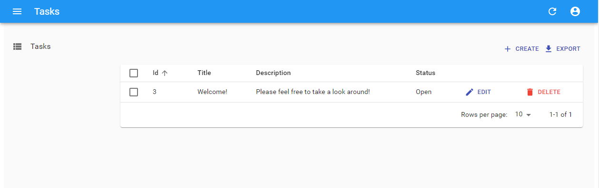

# Task Management Project

A simple task management SPA built with React-Admin.

## Description

The project is a simple task management Single Page App. Using the app, a user can sign up using an email and password, and perform CRUD operations on their list of tasks which are persisted to a database.

This frontend SPA using React is a work in progress.

The REST API is a Node app written using the NestJS server platform. See [Task-Management-NestJS](https://github.com/mpetrus001/task-management-nestjs) for more details.



## Getting Started

### Dependencies

To build and run you will need the following installed

- Git
- Docker
- Docker-Compose

For developement you will need the following installed

- Git
- Node

### Running the App

1. Clone the repo

```bash
$ git clone git@github.com:mpetrus001/task-management-react.git
```

1. Build the image

```bash
$ docker build -t <image_name> .
```

1. Enter <image_name> into the docker-compose file
1. Check your environment variables

```bash
$ cp .env.sample .env
$ vim .env
```

1. Start the app

```bash
$ docker-compose up
```

### Developing

1. Clone the repo

```bash
$ git clone git@github.com:mpetrus001/task-management-nestjs.git
```

1. Install dependencies

```bash
$ npm install
```

1. Make sure that your back-end is running
1. Run the server in watch mode

```bash
$ npm start
```

## Version History

- See [commit change](https://github.com/mpetrus001/task-management-react/commits/main) or See [release history](https://github.com/mpetrus001/task-management-react/releases)

## License

This project is licensed under the MIT License - see the LICENSE.md file for details

## Acknowledgments

This project was bootstrapped with [Create React App](https://github.com/facebook/create-react-app), adn relies on the work by the [React-Admin Team](https://https://github.com/marmelab/react-admin).
